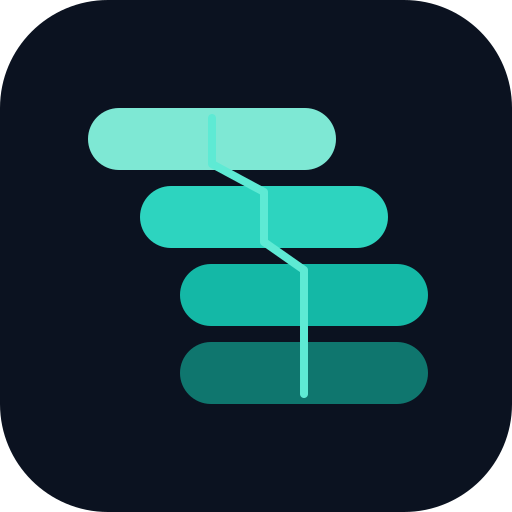

# Spine Framework

**Spine Framework** is an AI-agent-friendly software development practice framework:
principles, governance contracts, and adaptation guidance for teams that use
coding agents (Cursor and similar) with an honest audit trail.

This public repository ships **lane A** (framework docs) and **lane B** Cursor
Marketplace plugins (wave 1 plus `spine-agent-probes`). Private lab material
stays private — **slice, don't lift**.

## What's in this repo (v0.3)

| Path | Role |
|------|------|
| [`docs/governance/framework-overview.md`](docs/governance/framework-overview.md) | Spine identity, axes, front-matter contract |
| [`docs/governance/framework-contributing.md`](docs/governance/framework-contributing.md) | Add / retire / rename checklist |
| [`docs/principles/ai-governance-principles.md`](docs/principles/ai-governance-principles.md) | Memory, sealing, attribution, accountability |
| [`docs/framework-manifest.yml`](docs/framework-manifest.yml) | Trimmed inventory of exported members only |
| [`docs/issues.md`](docs/issues.md) | Product issue register (`SPC-` IDs) |
| [`.cursor-plugin/marketplace.json`](.cursor-plugin/marketplace.json) | Multi-plugin marketplace manifest |
| [`plugins/spine-agent-file-operations/`](plugins/spine-agent-file-operations/) | File-ops rule + skills (`0.1.0`) |
| [`plugins/spine-agent-probes/`](plugins/spine-agent-probes/) | `-AgentSummary` / `-Json` probe contract + skill (`0.1.1`) |
| [`plugins/spine-logging-governance/`](plugins/spine-logging-governance/) | Logging rule + skill + empty log templates |
| [`plugins/spine-config-gate/`](plugins/spine-config-gate/) | Sphinx gate rule + lite agent |
| [`LICENSE`](LICENSE) | MIT |

## Install

### Cursor Marketplace (after listing)

1. Open **Customize** in the sidebar.
2. Find the Spine Framework plugins (`spine-agent-file-operations`, `spine-agent-probes`,
   `spine-logging-governance`, `spine-config-gate`).
3. Choose **Install** and pick a **scope**:
   - **User** — follows you across every project. Use when these governance
     primitives should be default everywhere.
   - **Project** (workspace) — this folder only. Prefer this for graded labs,
     client trees, or any repo that must not inherit agent-file-ops / Sphinx
     habits.
   - **Team** — Cursor Team/Enterprise shared marketplace. This public GitHub
     tree does **not** configure your org; vendor it into a private team
     marketplace if you need Required / Default On.

Until the public Marketplace review is approved, use **Local** below.
Maintainers submit at
[cursor.com/marketplace/publish](https://cursor.com/marketplace/publish)
with this repository URL.

### Local (clone / pre-review)

Symlink each plugin directory into `~/.cursor/plugins/local/<name>` (user-scope
local load), then **Reload Window**. See each plugin `README.md`. That path is
user-wide, not project-scoped.

Install order (soft): file-operations → agent-probes → logging-governance →
config-gate.

## Wave 2 (not in this tag)

This tag ships wave-1 plugins plus `spine-agent-probes`. Later extracts (no
date promise): `spine-completion-evidence`, `spine-task-decomposition`, and a
re-export of wave-1 rules after the private lab has moved. Those slices land
in later tags, not as a silent overwrite of 0.3.2.

## Honest gap vs a private lab

This tree is a **slice**, not a dump of anyone's private `.cursor` workspace.
The public umbrella is **Spine Framework**; product ids stay `spine-*`. You do
**not** get audit logs, plan files, shell allowlists, live MCP configs,
exam-mode course policy, or the always-apply rule set that has moved since the
last export. Wave-1 plugins here can lag the author's private sources. Local
clone + symlink stays a supported install path even after a Marketplace
listing.

## Documentation

- [CHANGELOG.md](CHANGELOG.md)
- [docs/issues.md](docs/issues.md)

## What is not here

- Private lab logs, plans, decision seals, or machine allowlists
- Live MCP server configs or shell allowlists (consumers keep their own)
- Full private workspace mirror

## License

MIT — see [`LICENSE`](LICENSE).

## AI assistance

Public docs were prepared with Cursor Agent assistance for redaction and
structure. The family marketplace mark (`assets/logo.svg`) was generated and
vectorized with Cursor Agent on 2026-08-29. Humans own every publish decision. Product changelog starts at
`v0.1.0` in this tree.

## Related

- Cursor [Plugins reference](https://cursor.com/docs/reference/plugins) (future plugin waves)
- Probe **implementation** (PowerShell module + dual-host / ShellGuard templates): [spine-automation](https://github.com/villepispa/spine-automation) — use with `plugins/spine-agent-probes`
- Sibling product: [winget-audit](https://github.com/villepispa/winget-audit)
